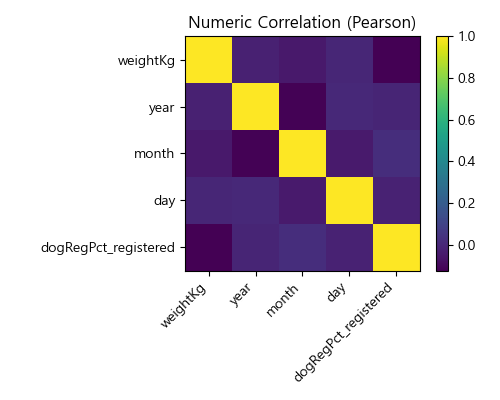
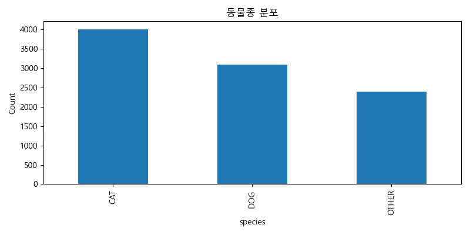
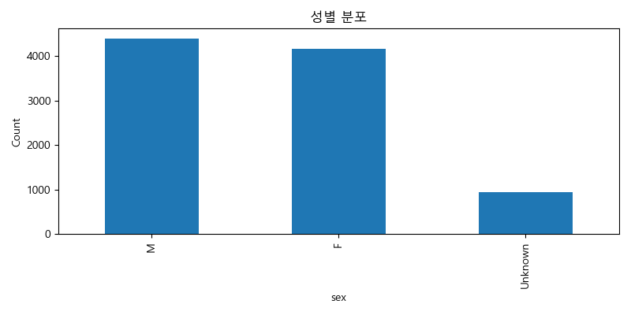
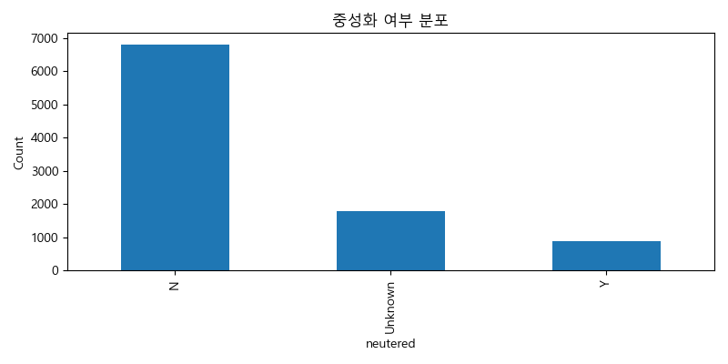
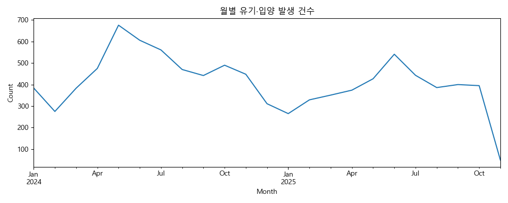
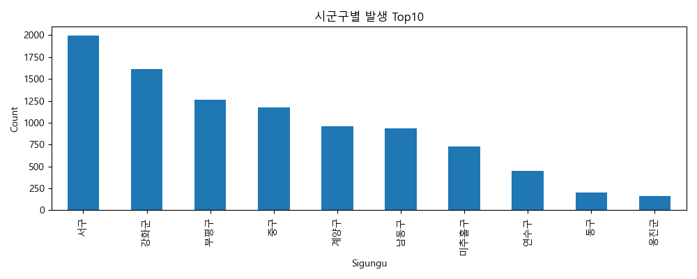
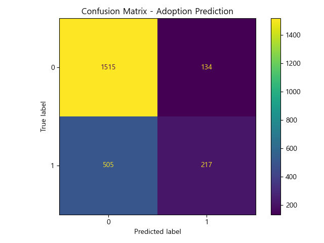

# 🐾 인천광역시 반려동물 유기·입양 패턴 분석 중간보고서

---

## 1. 🔎 프로젝트 개요

본 프로젝트는 **인천광역시 유기·입양 동물 및 반려동물 등록 현황 데이터를 기반**으로
유기동물의 특성 분석, 지역·계절별 발생 패턴 파악,
보호소별 유기동물 규모 분석, 그리고 **입양 여부 예측 모델 구축**을 목표로 한다.

또한 향후에는 동일한 분석 프레임워크를
**전국 데이터로 확장**하여 정책·행정 활용이 가능한 예측 모델로 발전시킬 계획이다.

---

# 2. 📂 사용 데이터

### **① 국가동물보호정보시스템_유기동물 조회 서비스 (15098931)**

* 유기동물 개체 정보(종, 성별, 중성화 여부, 몸무게 등)
* 유기 날짜
* 발생 지역(시군구)
* 보호센터 코드
* 보호 종료 사유(입양·반환·안락사·기타 등)

📌 → **우리의 주된 분석 데이터**

---

### **② 동물보호센터 조회 서비스 (15098915)**

* 보호센터명
* 주소(시도/시군구)
* 관리기관명
* 연락처
* 보호 가능 두수 등 시설정보

📌 → **유기 발생량을 보호센터별로 매핑하는 데 사용**

---

### **③ 인천광역시 반려동물 보유·등록 현황 CSV (15066067)**

* 행정동별 등록두수
* 반려동물 보유 현황
* 등록대비 보유율 계산 가능

📌 → **등록률이 낮은 지역에서 유기 발생이 높은지 비교 분석**

---

# 3. 🧹 데이터 전처리

* API 데이터(JSON) 파싱 후 Pandas DataFrame으로 변환
* 날짜(`happenDt`)로부터 year/month/day 분리
* 성별(M/F/Unknown), 중성화(Y/N/Unknown) 정리
* 보호센터 코드로 보호소 주소 Join
* 인천 반려동물 등록 현황 CSV를 Sigungu 기준으로 Join
* 입양 여부 라벨링(입양=1, 그 외=0)

---

# 4. 📊 탐색적 데이터 분석 (EDA)

아래 모든 그래프는 **인천 데이터 기반 15098931 API + CSV로 만든 분석 결과**임.

---

## 4.1 📈 수치형 변수 상관관계



* 상관관계 전반적으로 낮음
* 날짜(월/일) 간 약한 패턴 존재
* 몸무게와 결과(outcomeType) 간 상관은 낮음

---

## 4.2 🐾 동물종 분포



고양이(CAT) > 개(DOG) > 기타 순
→ 인천 지역 특성: 고양이 구조율이 더 높음

---

## 4.3 👦 성별 분포



* M/F 비율 유사
* Unknown 존재 → 데이터 품질 이슈 내포

---

## 4.4 ✂ 중성화 여부 분포



* 중성화 X(Z) 비율이 가장 높음
* Unknown도 많음
  → 실제 보호소 데이터의 특징 반영

---

## 4.5 🗓 월별 유기·입양 추세



* 4~6월 증가
* 12~1월 감소
  → 계절성 매우 뚜렷함

---

## 4.6 📍 시군구별 유기동물 발생 상위 10곳



* **서구, 강화군, 부평구** 중심
* 외곽 지역에서 더 많이 발생하는 경향
* 등록 현황(15066067)과 결합하면 더 명확한 분석 가능

---

# 5. 🤖 입양 예측 모델 결과 (Machine Learning)

### Confusion Matrix



---

### Classification Report

```
precision    recall  f1-score   support

0 (미입양): 0.7500    0.9187    0.8258    1649
1 (입양)  : 0.6182    0.3006    0.4045     722

Accuracy: 0.7305
ROC-AUC: 0.728
```

### 모델 해석

* 초기 모델 정확도 **73%**, ROC-AUC **0.728**
* 입양(1)의 recall 낮음 → 데이터 불균형 영향
* 개선 방법

  * SMOTE
  * weighted loss
  * feature engineering (센터 정보, 등록률, 품종 등 추가)

---

# 6. 📈 인사이트 요약

| 구분  | 결과                 |
| --- | ------------------ |
| 종   | 고양이 구조율이 가장 높음     |
| 성별  | 남녀 비슷, Unknown 존재  |
| 중성화 | 미중성 비율 높음          |
| 계절성 | 여름철 증가, 겨울철 감소     |
| 지역성 | 서구·강화군·부평구 중심      |
| 모델  | 정확도 73%, AUC 0.728 |

---

# 7. 🌍 향후 계획 — 인천 → 전국 확장 전략

현재 단계는 **인천 데이터 기반 중간분석**,
최종 분석은 아래 3개 전국 단위 API로 확장 예정이다.

### 전국 확장 데이터

| API        | 설명            |
| ---------- | ------------- |
| (15098931) | 전국 유기동물 데이터   |
| (15098915) | 전국 동물보호센터 정보  |
| (15103156) | 전국 반려동물 등록 현황 |

---

### 전국 확장 로드맵

1. 전국 유기·입양 데이터 수집 파이프라인 구축
2. 보호소 위치 기반 Hotspot 지도 생성
3. 반려동물 등록률(15103156)과 유기율을 결합한 정책 분석
4. Prophet 기반 계절성 예측 → 지역 특화 모델
5. 전국 입양 예측 모델(XGBoost + Prophet Hybrid)
6. Streamlit 대시보드 제작 → 정책적 의사결정 지원
7. 최종보고서 + 정책 제안서 작성

---

# 8. 🧠 결론

본 중간보고서는
**인천광역시 유기·입양·등록 현황 데이터**를 중심으로
EDA 분석 및 초기 머신러닝 예측 모델 구축 결과를 제시하였다.

현재까지의 분석으로
종·성별·중성화·계절성·지역성 패턴이 명확히 드러났으며
입양 예측 모델도 초기 성능을 확보하였다.

향후에는 전국 API로 범위를 확대하여
정책 기반의 **전국 반려동물 보호·입양 모델**로 발전시킬 예정이다.
